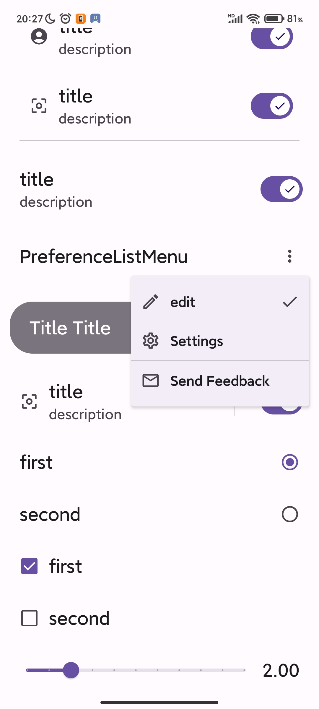

# compose material design 3 ，Preference interface components

[中文](README_cn.md)

version [](https://jitpack.io/#Knightwood/ComposePreference)

```css
dependencies {

Required
  implementation 'com.github.Knightwood.ComposePreference:preference-data-core:1.2'
  implementation 'com.github.Knightwood.ComposePreference:preference-ui-compose:1.2'

Optional, Choose one of the three, or implement your own
  implementation 'com.github.Knightwood.ComposePreference:preference-util:1.2'
  implementation 'com.github.Knightwood.ComposePreference:datastore-util:1.2'
  implementation 'com.github.Knightwood.ComposePreference:preference-mmkv-util:1.2'
}
```


 


## supported tools for storing preference values

There are three tools available to store preference values

1. DataStore
2. MMKV
3. SharedPreference

However, note that SharedPreference does not support storing double value, and MMKV does not support set <string>types, and they support different ones.


## Interface components

To build a preference interface, you need to wrap the interface component of the preference with 'Preferences Scope' (the Preferences Scope uses a column inside, so you can place any compose function, and if the existing preference component can't meet your needs, you can place any kind of compose function to build the interface), and send a message to 'Preferences).
Scope' passes in one of the three tools supported above (of course, you can also customize additional storage methods such as databases and files by inheriting the interface yourself)

sample code:

```kotlin
//Use PreferencesScope function to wrap the re-composable function and pass in the setting tool that stores the preferences

//1. You can use the Data Store to store preference values
// val holder = DataStorePreferenceHolder.instance(
//	dataStoreName = "test",ctx =AppCtx.instance
//)
    
2.You can use the mmkv to store preference values
// val holder = MMKVPreferenceHolder.instance(MMKV.defaultMMKV())

//3. You can use the SharedPreference to store preference values
val  holder =  OldPreferenceHolder.instance(
     AppCtx.instance.getSharedPreferences("ddd",Context.MODE_PRIVATE)
    )

PreferencesScope(holder=holder) {
    //Here you can use some compose functions to construct the interface, 
    // or use other compose functions to build a unique interface
    PreferenceItem(title = "PreferenceItem")
    PreferenceItemVariant(title = "PreferenceItemVariant")
    PreferencesHintCard(title = "PreferencesHintCard")
    PreferenceItemLargeTitle(title = "PreferenceItemLargeTitle")
    PreferenceItemSubTitle(text = "PreferenceItemSubTitle")
    PreferencesCautionCard(title = "PreferencesCautionCard")
    PreferenceSwitch(
        keyName = "bol",
        title = "title",
        description = "description"
    )
    //Collapsible preference component
    CollapsePreferenceItem(
        title = "title",
        description = "description"
    ) {
        //There are a lot of collapsed components that can be placed here.
        // Internally used column to display
        PreferenceSwitch(
            keyName = "bol2",
            title = "title",
            description = "description",
            icon = Icons.Filled.CenterFocusWeak
        )
        
        PreferenceSwitch(
            keyName = "bol34",
            title = "title",
            description = "description",
            icon = Icons.Filled.CenterFocusWeak
        )
        
    }
    PreferenceSwitchWithDivider(
        keyName = "bol2",
        title = "title",
        description = "description",
        icon = Icons.Filled.CenterFocusWeak
    )
    PreferenceSwitchWithContainer(
        keyName = "bol2",
        title = "Title ".repeat(2),
        icon = null
    )
    PreferenceRadioGroup(
        keyName = "radioGroup",
        labels = listOf(
            "first",
            "second"
        ),
        left = false,//This allows you to put the radio on the right and the text on the left, and the same goes for Check Box
        changed = {
            //This gets the new value after the modification, which is supported by most components
            Log.d(TAG, "radio: ${it}")
        }
    )
    PreferenceCheckBoxGroup(
        keyName = "CheckBoxGroup",
        labels = listOf(
            "first",
            "second"
        ), changed = {
            Log.d(TAG, "checkbox: ${it.joinToString(",")}")
        }
    )
    PreferenceSlider(
        keyName = "slider", min = 0f,
        max = 10f, steps = 9, value = 0f, changed = {
            Log.d(TAG, "slider: $it")
        }
    )
    //DropDownMenu
    PreferenceListMenu(
        title = "PreferenceListMenu",
        keyName = "PreferenceListMenu",
        list = listOf(
            MenuEntity(
                leadingIcon = Icons.Outlined.Edit,
                text = "edit",
                labelKey = 0
            ),
            MenuEntity(
                leadingIcon = Icons.Outlined.Settings,
                text = "Settings",
                labelKey = 1
            ),
            MenuDivider,//Dividing line
            MenuEntity(
                leadingIcon = Icons.Outlined.Email,
                text = "Send Feedback",
                labelKey = 2
            ),
        )
    )
}


```
## Dependencies and graying

* enable usage: When the preference component is set to false, specify the dependenceKey as DependenceNode.rootName, and the component can be grayed out to prevent the corresponding event.

* Use of dependencies: e.g. there are three switches: a, b, c


When switch A is toggled to off, b and c are grayed out.

Principle: We use a MutableState to store the enable state, b and c both observe this state, when the switch A is off, modify this state, b and c will be reorganized because of the observation of this state, so as to achieve the purpose.


Each preference composable function will generate such a state according to its key name, and save the state in the holder above, so there are two ways to disable b and c when switch A is off:

1. Register a state node (e.g. state node 1), specify the dependence keys of b and c as the name of node 1, and then modify the state of node 1
2. Specify the dependence key of b and c as the key name of a, and then get the node status of a and modify it, but note that the switch a needs to specify the dependence key as something else, otherwise a will also be affected


Example of the first way
```kotlin
PreferencesScope(holder = holder) {

    val node = holder.registerDependence("customNode", true)// 1 create a new state node

//Preference Component
    PreferenceSwitchWithDivider(
        keyName = "bol3",
        title = "title",
        dependenceKey = "customNode", // 2 Indicates that the state depends on the 'node' above
        description = "description",
        icon = Icons.Filled.CenterFocusWeak
    )
    PreferenceSwitch(
        keyName = "bol2",
        title = "title",
        description = "description",
        icon = Icons.Filled.CenterFocusWeak
    ) {
        node.enableState.value = it //3 Modify the node state
    }
}

```
1. Code 1 creates a custom state node with the enable state to true and names the node "custom Node"
2. Code 2 indicates that the enable state of the Preference Item composable function depends on the state of the node named "custom Node" created in 1
3. Code 3 modifies the enable state of "custom node" according to the switch, and the composable functions that depend on this node will be affected


Example of the second way

```kotlin
PreferencesScope(holder = holder) {
    //switch A
    PreferenceSwitch(
        keyName = "bol",
        title = "title",
        dependenceKey = DependenceNode.rootName,//Specify the dependency as the root node so that it is not affected
        description = "description"
    ) { state ->
        //Here the current enable state is obtained and modified,
        //Dependencies on this node will change the display state,
        //If you don't currently specify a dependency, you'll also be affected
        holder.getDependence("bol")?.let {
            it.enableState.value = state
        }
    }
    //switch B
    PreferenceSwitch(
        keyName = "bol2",
        title = "title",
        dependenceKey = "bol", //A state that depends on the status where the key is "bol"
        description = "description",
        icon = Icons.Filled.CenterFocusWeak
    )
}
```
In this example, there is no create a new state node, but it will achieve the effect.

This is because the preference composable function will generate a node based on its own keyName and enable parameters (switch A passes keyName is "bol", enable defaults to true) and saves it. The status node can be obtained by calling holder.getDependence(key name).

switch B depends on the enabled state registered by switch A, when A obtains the node state through the getDependence method and makes modifications,
switch B will be reassembled and grayed out.

However, we found that switch A was not grayed out because of the modified state, because switch A specified its dependence as a default built-in state node, so switch A would be affected by the DependenceNode.rootName node
However, it is not affected by the state of its own node.
If you want switch A to be affected by its own node status, you only need to leave switch A null without specifying the dependenceKey.
