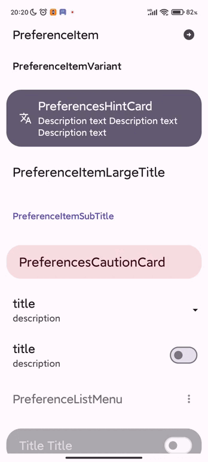
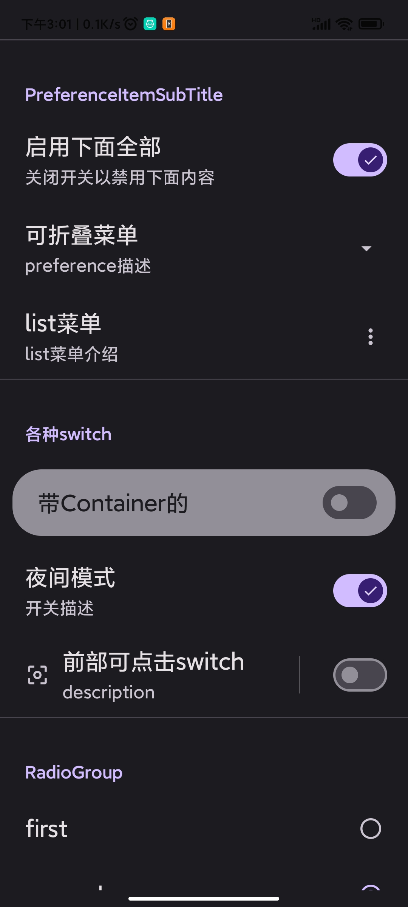

# preference 工具库

包含了sharedPreference、mmkv、datastore的读写工具、委托实现，以及界面组件，以及节点依赖功能。

其中，ui组件 与 AndroidX preference库一样，它可以自动保存并显示首选项

当然，也有跨平台版：[链接](https://github.com/Knightwood/ComposePreferenceMultiplatform)

**[英文](README_en.md)**

## 版本
** [](https://jitpack.io/#Knightwood/ComposePreference) **

```kotlin
dependencies {
    val version = "1.2.7"
    //必选
    implementation("com.github.Knightwood.ComposePreference:preference-data-core:$version")
    //如不需要界面，可以不引入此依赖
    implementation("com.github.Knightwood.ComposePreference:preference-ui-compose:$version")

    //偏好值读写工具，下面三选一，或者自己实现读写接口
    implementation("com.github.Knightwood.ComposePreference:preference-util:$version")
    implementation("com.github.Knightwood.ComposePreference:datastore-util:$version")
    implementation("com.github.Knightwood.ComposePreference:preference-mmkv-util:$version")
}
//注：如果使用mmkv,sharedpreference,你自己的工程不要忘记引入相应mmkv,sharedpreference依赖，以及初始化mmkv等。
```

* 一些破坏性改动
    * ui组件重写
    * 方法名 getReadWriteTool 改为 getSingleDataEditor
    * 接口名 IPreferenceReadWrite 改为 IPreferenceEditor

特性：

使用简单，界面和偏好值读写分离

支持切换多种存储/读取方式

可自定义偏好值读写过程工具

提供界面组件启用状态节点依赖功能

可脱离界面，单独使用偏好值读写工具，并提供了统一写入和读取（使用flow观察值的变化）方法

也可以仅使用ui界面

## 介绍图

|                                               |                                               |                                                                                    |
|:---------------------------------------------:|:---------------------------------------------:|:----------------------------------------------------------------------------------:|
|  |  |  |
|  |  |                                       |

## 支持的存储偏好值的工具

内置三种可用的存储偏好值的工具

1. DataStore
2. MMKV
3. SharedPreference

但是注意，SharedPreference不支持存储double，mmkv不支持set<string>类型，他们所支持的有所差异。
DataStore则不支持同步的方式读取。

还可以继承`PreferenceHolder`和`IPreferenceEditor`实现额外的存储过程，例如存储到文件、数据库等。

* 对于仅需要preference读写工具，而不需要ui界面的，可以仅引入`com.github.Knightwood.ComposePreference:preference-data-core`
  和任意一种读写工具。

* 对于仅需要ui界面，可以仅引入`com.github.Knightwood.ComposePreference:preference-ui-compose`
  和`com.github.Knightwood.ComposePreference:preference-data-core`。

## 委托工具类

使用委托工具，可以像读写普通变量一样读写偏好值

### mmkv 委托工具

```kotlin
 class MMKVHelper private constructor(val mmkv: MMKV) {
    //使用委托的方式生成一个委托对象，除了[parcelableM]方法，初始值可选
    var name by mv.strM("tom", "初始值")
}

//1. 获取单例
val helper = MMKVHelper.getInstance(prefs)
//2. 使用赋值将值存入
helper.name = "Tom"
//3. 直接使用即读取值，如果没有值写入，读取出来的会是默认值。
log.d(TAG, helper.name)

```

### SharedPreference 委托工具

```kotlin
//注意，PrefsHelper 是单例。
class PrefsHelper private constructor(val prefs: SharedPreferences) {
    var isFinish by prefs.boolean("isFinish")
    var name by prefs.string("name")
    var age by prefs.int("age")
    //***其余无关代码省略
}

//1. 获取单例
val helper = PrefsHelper.getInstance(prefs)
//2. 使用赋值将值存入
helper.name = "Tom"
//3. 直接使用即读取值，如果没有值写入，读取出来的会是默认值。
log.d(TAG, helper.name)
```


### DataStore 委托工具

```kotlin
//1. 需要有一个协程作用域
val scope = CoroutineScope(Dispatchers.IO)
//2. 你可以将属性委托给datastore，变量名就是key的名称
var username by dataStore.getting(11, scope)

//3. 对数据读写就可以存储到datastore
MaterialTheme {
    //可以在compose中观察数据变化
    val va = dataStore.asDataFlow<Int>("username").collectAsState(initial = 11)
    Column {
        Button(onClick = {
            val randoms = Random.nextInt(0, 11)
            //赋值就会将数据写入datastore
            username = randoms
            //访问变量就可以得到刚刚写入的数据
            println(username)
        }) {
            Text("Random")
        }
        Text("value:${va.value}")
    }
}
```

## ui

ui 部分分为了两组api：
1. cross包下面是纯粹的ui界面，不会自动读取和存储偏好值，也没有节点依赖功能。
2. auto包下面则是可以自动读取和存储偏好值的界面，并且支持节点依赖功能。

preference组件提供了自定义主题的功能，以修改间距，颜色，字体，边框等。
这对于统一组件的样式比较方便，不用在写界面时每个方法都传入一遍样式相关的参数。

### ui的使用
#### 单纯的ui组件

这些组件和方法都在`com.kiylx.compose.preference.component.cross`包下

使用`com.kiylx.compose.preference.theme.Preferences.SetTheme`设置和修改主题。

```kotlin

@Composable
fun SettingsScreen() {
    Column(
        modifier = Modifier
            .verticalScroll(rememberScrollState()),
        verticalArrangement = Arrangement.spacedBy(4.dp)
    ) {
        Preferences.SetTheme(
            iconStyle = PreferenceIconStyle(
                paddingValues = PaddingValues(8.dp),
                tint = MaterialTheme.colorScheme.onPrimary,
                backgroundColor = MaterialTheme.colorScheme.primary,
            )
        ) {
            PreferenceItemTest()
            PreferenceSubTitle(
                modifier = Modifier.padding(top = 8.dp),
                title = "其他"
            )
            var progress by remember {
                mutableStateOf(0f)
            }
            PreferenceSlider(
                value = progress,
                desc = "滑动条描述",
                onValueChanged = { progress = it })
            SwitchTest()
            PreferenceSubTitle(title = "多选框", modifier = Modifier)
            CheckBoxTest()
            PreferenceSubTitle(title = "单选框", modifier = Modifier)
            RadioTest()
            PreferenceSubTitle(title = "折叠", modifier = Modifier)
            var expand by remember { mutableStateOf(false) }
            PreferenceCollapseItem(
                expand = expand,
                title = "附加内容",
                stateChanged = { expand = !expand })
            {
                Preferences.SetTheme {
                    Column(modifier = Modifier.padding(top = 12.dp, start = 12.dp, end = 12.dp)) {
                        PreferenceItemTest()
                    }
                }
            }
        }
    }
}
```

#### 自动存储读取偏好值，带节点依赖的ui组件

* 要构建一个自动存储偏好值的preference界面，需要使用`com.kiylx.compose.preference.component.auto.SetTheme`函数
  且传入上面支持的三种工具之一（当然你也可以自己继承接口定制额外的存储方式，例如数据库和文件）

```
@Composable
fun NewComponents2(ctx: Context) {
    //1. 使用dataStore存储偏好值
    val holder = remember {
        DataStorePreferenceHolder.instance(
            dataStoreName = "test",
            ctx = AppCtx.instance
        )
    }

    //2. 使用mmkv存储偏好值
//        val holder = remember {
//            MMKVPreferenceHolder.instance(MMKV.defaultMMKV())
//        }
    //3. 使用sharedprefrence存储偏好值
//        val holder = remember {
//            OldPreferenceHolder.instance(
//                AppCtx.instance.getSharedPreferences(
//                    "ddd",
//                    Context.MODE_PRIVATE
//                )
//            )
//        }
    val customNodeName = "customNode"
    //创建一个自定义节点
    val node = holder.registerDependence(customNodeName, true)
    val scope = rememberCoroutineScope()

    Column(
        modifier = Modifier
            .verticalScroll(rememberScrollState()),
        verticalArrangement = Arrangement.spacedBy(4.dp)
    ) {
        Preferences.SetTheme(
            holder = holder,
            iconStyle = PreferenceIconStyle(
                paddingValues = PaddingValues(8.dp),
                tint = MaterialTheme.colorScheme.onPrimary,
                backgroundColor = MaterialTheme.colorScheme.primary,
            )
        ) {

            Column {
                PreferenceSwitch(
                    defaultValue = false,
                    title = "使用新特性",
                    desc = "实验功能，可能不稳定",
                    dependenceKey = DependenceNode.rootName,
                    keyName = "s1"
                ) { state ->
                    //这里获取并修改了当前的enable状态，
                    //依赖这个节点的会改变显示状态，
                    //如果当前没有指定依赖，自身也会受到影响
                    scope.launch {
                        holder.getDependence("s1")?.setEnabled(state)
                    }
                }
                PreferenceItem(
                    dependenceKey = "s1",
                    title = "关联组件",
                    icon = Icons.Outlined.AccountCircle
                )

                PreferenceSwitchWithContainer(
                    title = "调整您的设置信息",
                    desc = "账户、翻译、帮助信息等",
                    defaultValue = false,
                    keyName = "b2",
                    dependenceKey = DependenceNode.rootName,
                    icon = Icons.Outlined.AccountCircle,
                ) {
                    scope.launch {
                        node.setEnabled(it)
                    }
                }
                PreferenceItem(
                    modifier = Modifier,
                    title = "账户",
                    icon = Icons.Outlined.AccountCircle,
                    dependenceKey = customNodeName,
                    desc = "本地、谷歌",
                )
                var expand by remember { mutableStateOf(false) }
                PreferenceCollapseItem(
                    expand = expand,
                    title = "附加内容",
                    dependenceKey = customNodeName,
                    stateChanged = { expand = !expand })
                {
                    Column(modifier = Modifier.padding(horizontal = 16.dp)) {
                        PreferenceItem(
                            title = "动画",
                            icon = Icons.Outlined.TouchApp,
                            desc = "动画反馈、触感反馈",
                        )
                        PreferenceItem(
                            title = "语言",
                            desc = "中文(zh)",
                            icon = Icons.Outlined.Language,
                        )
                    }
                }
                PreferencesCautionCard(
                    title = "调整您的设置信息",
                    desc = "账户、翻译、帮助信息等",
                    dependenceKey = customNodeName,
                    icon = Icons.Outlined.AccountCircle,
                )

            }
        }
    }
}
```

### 可用的组件：

**大卡片**

* PreferencesCautionCard
* PreferencesHintCard

**preference item**

* PreferenceSubTitle
* PreferenceItem

**switch**

* PreferenceSwitch
* PreferenceSwitchWithContainer
* PreferenceSwitchWithDivider

**可折叠其他组件的box**

* PreferenceCollapseItem

**Radio**

* PreferenceRadio

**CheckBox**

* PreferenceCheckBox

**Slider**

* PreferenceSlider

## 依赖和置灰

* enable使用: preference组件传入enable为false的同时，指定dependenceKey为DependenceNode.rootName，可以置灰组件，使之无法相应事件。

* 依赖的使用：例如：有三个开关：a,b,c

当开关a切换为off时，将b和c置灰。

原理：我们使用一个mutableState保存enable状态，b和c都观察这个状态，当开关a为off时修改这个状态，b和c就会因为观察这个状态而重组，从而达到目的。

每一个preference可组合函数，都会根据自身的keyName生成一个这样的状态，并将状态保存在上面的holder中，所以要达到开关a为off时禁用b和c，有两种方式：

1. 自己注册一个状态节点（例如为node1），然后将b，c的dependenceKey指定为node1的name，然后修改这个node1状态
2. 将b，c的dependenceKey指定为a的keyName，然后获取a的节点状态并进行修改，但是要注意，开关a需要指定dependenceKey为其他，否则a也会受到影响

第一种方式例子：

```kotlin
PreferencesScope(holder = holder) {

    val node = holder.registerDependence("customNode", true)// 1

//PreferenceItem可组合函数
    PreferenceSwitchWithDivider(
        keyName = "bol3",
        title = "title",
        dependenceKey = "customNode", // 2
        description = "description",
        icon = Icons.Filled.CenterFocusWeak
    )
    PreferenceSwitch(
        keyName = "bol2",
        title = "title",
        description = "description",
        icon = Icons.Filled.CenterFocusWeak
    ) {
        node.enableState.value = it //3 修改节点状态
    }
}

```

1. 代码1处创建一个了一个自定义状态节点，enable状态为true，并将节点命名为"customNode"
2. 代码2处表示这个PreferenceItem可组合函数的enable状态依赖于1处创建的名为"customNode"的节点状态
3. 代码3处根据switch修改了"customNode"的enable状态，此时，依赖此node的可组合函数都会收到影响

第二种方式例子

```kotlin
Preferences.SetTheme(holder = holder) {
    //switch A
    PreferenceSwitch(
        keyName = "bol",
        title = "title",
        dependenceKey = DependenceNode.rootName,//指定依赖为根结点，这样自身就不会受到影响
        description = "description"
    ) { state ->
        //这里获取并修改了当前的enable状态，
        //依赖这个节点的会改变显示状态，
        //如果当前没有指定依赖，自身也会受到影响
        holder.getDependence("bol")?.let {
            it.enableState.value = state
        }
    }
    //switch B
    PreferenceSwitch(
        keyName = "bol2",
        title = "title",
        dependenceKey = "bol", //依赖key为bol的状态
        description = "description",
        icon = Icons.Filled.CenterFocusWeak
    )
}
```

这个例子中没有new一个node，却能达到效果。

这是因为preference可组合函数会根据自身的keyName和enable参数（ switch A 传入的keyName为"bol"
，enable默认为true），生成一个node保存起来。 可以通过调用holder.getDependence(key name)得到状态节点。

switch B 依赖于switch A 注册的enable状态，当A通过getDependence方法获取到节点状态并做出修改时，
switch B 就会重组从而置灰。

但我们发现，switch A却没有因为修改状态被置灰，这是因为 switch A 把自己的dependence指定为了一个默认的内置状态节点，所以switch
A会受到DependenceNode.rootName节点影响
却不会受到自身节点状态的影响。
若希望switch A收到自身节点状态的影响，只需要switch A不指定dependenceKey，保持它为null即可。


## 直接使用偏好值读写工具

对于datastore提供了prefStoreHolder.getSingleDataEditor()方式
对于mmkv和SharedPreference,分别提供了两种工具，一种是prefStoreHolder.getSingleDataEditor()方式，一种是委托的方式

### prefStoreHolder.getSingleDataEditor()方式

MMKV,SharedPreference,DataStore均支持此种方式，这也是Preference组件所需要的读写工具

```
//1，获取读写工具
//MMKV
 val prefStoreHolder = MMKVPreferenceHolder.instance(MMKV.defaultMMKV())

//SharedPreference
val  prefStoreHolder =  OldPreferenceHolder.instance(
     AppCtx.instance.getSharedPreferences("ddd",Context.MODE_PRIVATE)
    )
    
//DataStore
val prefStoreHolder = DataStorePreferenceHolder.instance(
                        dataStoreName = "test",
                        ctx = AppCtx.instance
                    )

//2，获取某个偏好值读写器
val pref =prefStoreHolder.getSingleDataEditor(keyName = keyName, defaultValue = "")

//3，获取偏好值

pref.flow().collect { s ->
	//flow收集到偏好值的变更
}
或者
val currentValue = pref.flow().collectAsState(defaultValue)

//4， 写入偏好值
pref.write("")
```

