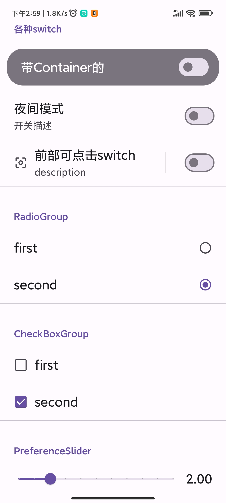
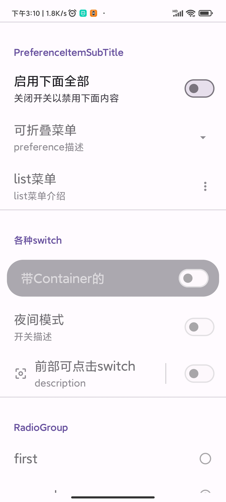

# Preference component of the Material 3 design

like androidx preference library, it can auto save and show preference

also we have multiplatform version：[link](https://github.com/Knightwood/ComposePreferenceMultiplatform)

**[中文](README_cn.md)**

## version [](https://jitpack.io/#Knightwood/ComposePreference)

```kotlin
dependencies {
    val version = "1.2.2"
    //Required
    implementation("com.github.Knightwood.ComposePreference:preference-data-core:$version")
    //If you don't need an interface, you can leave this dependency unintroduced
    implementation("com.github.Knightwood.ComposePreference:preference-ui-compose:$version")

    //Preference value reading and writing tools， Choose one of the three, or implement your own
    implementation("com.github.Knightwood.ComposePreference:preference-util:$version")
    implementation("com.github.Knightwood.ComposePreference:datastore-util:$version")
    implementation("com.github.Knightwood.ComposePreference:preference-mmkv-util:$version")
}
//Note: If you use mmkv and sharedpreference, don't forget to introduce the corresponding mmkv, sharedpreference dependencies, and initialize mmkv in your own project.
```
* Some breaking changes
 * The method name "getReadWriteTool" has been changed to "getSingleDataEditor"
 * The interface name "IPreferenceReadWrite" has been changed to "IPreferenceEditor"

**!!! The following documents are translated by Microsoft Translator**

## Characteristic:

Simple to use, interface and preference value read and write separation

Preference reading and writing processes can be customized

Provides the UI component to enable the status node dependency function

Preference reading and writing tools can be used separately from the interface, and a unified
writing and reading method is provided

## Preview

|                                               |                                               |                                                                                    |
|:---------------------------------------------:|:---------------------------------------------:|:----------------------------------------------------------------------------------:|
|  |  |  |
|  |  |                                       |

# Usage

## supported tools for storing preference values

There are three tools available to store preference values

1. DataStore
2. MMKV
3. SharedPreference

However, note that SharedPreference does not support storing double value, and MMKV does not support
set <string>types, and they support different ones.
SataStore does not support synchronous reads

You can also inherit PreferenceHolder and IPreferenceEditor to implement additional stored
procedures, such as storing to a file, database, etc.

* if you only need preference editor,don not need ui component，could dependence `com.github.Knightwood.ComposePreference:preference-data-core`
and one editor。

* if you only need ui component，don not need preference editor，could dependence `com.github.Knightwood.ComposePreference:preference-ui-compose`
and `com.github.Knightwood.ComposePreference:preference-data-core`

## ui
The UI section is divided into two sets of APIs:
1. Underneath the Cross package is a pure UI interface, which does not automatically read and store preference values, and has no node dependency functions.
2. Below the auto package is an interface that can automatically read and store preference values, and supports node dependency functions.

The preference component provides the ability to customize the theme to modify spacing, colors, fonts, borders, etc.
This is convenient for unifying the styling of components, without having to pass in style-related parameters for each method when writing the interface.

### components usage
#### without auto read and write,use preference components only

These components and methods are all under the 'com.kiylx.compose.preference.component.cross' package

Use 'com.kiylx.compose.preference.theme.Preferences.SetTheme' to set and modify the theme.

```kotlin

@Composable
fun SettingsScreen() {
    Column(
        modifier = Modifier
            .verticalScroll(rememberScrollState()),
        verticalArrangement = Arrangement.spacedBy(4.dp)
    ) {
        Preferences.SetTheme(
            iconStyle = PreferenceIconStyle(
                paddingValues = PaddingValues(8.dp),
                tint = MaterialTheme.colorScheme.onPrimary,
                backgroundColor = MaterialTheme.colorScheme.primary,
            )
        ) {
            PreferenceItemTest()
            PreferenceSubTitle(
                modifier = Modifier.padding(top = 8.dp),
                title = "其他"
            )
            var progress by remember {
                mutableStateOf(0f)
            }
            PreferenceSlider(
                value = progress,
                desc = "滑动条描述",
                onValueChanged = { progress = it })
            SwitchTest()
            PreferenceSubTitle(title = "多选框", modifier = Modifier)
            CheckBoxTest()
            PreferenceSubTitle(title = "单选框", modifier = Modifier)
            RadioTest()
            PreferenceSubTitle(title = "折叠", modifier = Modifier)
            var expand by remember { mutableStateOf(false) }
            PreferenceCollapseItem(
                expand = expand,
                title = "附加内容",
                stateChanged = { expand = !expand })
            {
                Preferences.SetTheme {
                    Column(modifier = Modifier.padding(top = 12.dp, start = 12.dp, end = 12.dp)) {
                        PreferenceItemTest()
                    }
                }
            }
        }
    }
}
```

#### Automatically stores read preferences with node-dependent UI components

* To build a preference interface that automatically stores preferences, you need to use the 'com.kiylx.compose.preference.component.auto.SetTheme' function
  And pass in one of the three tools supported above (of course, you can also inherit the interface yourself to customize additional storage methods, such as databases and files)

```
@Composable
fun NewComponents2(ctx: Context) {
    //1. 使用dataStore存储偏好值
    val holder = remember {
        DataStorePreferenceHolder.instance(
            dataStoreName = "test",
            ctx = AppCtx.instance
        )
    }

    //2. 使用mmkv存储偏好值
//        val holder = remember {
//            MMKVPreferenceHolder.instance(MMKV.defaultMMKV())
//        }
    //3. 使用sharedprefrence存储偏好值
//        val holder = remember {
//            OldPreferenceHolder.instance(
//                AppCtx.instance.getSharedPreferences(
//                    "ddd",
//                    Context.MODE_PRIVATE
//                )
//            )
//        }
    val customNodeName = "customNode"
    //创建一个自定义节点
    val node = holder.registerDependence(customNodeName, true)
    val scope = rememberCoroutineScope()

    Column(
        modifier = Modifier
            .verticalScroll(rememberScrollState()),
        verticalArrangement = Arrangement.spacedBy(4.dp)
    ) {
        Preferences.SetTheme(
            holder = holder,
            iconStyle = PreferenceIconStyle(
                paddingValues = PaddingValues(8.dp),
                tint = MaterialTheme.colorScheme.onPrimary,
                backgroundColor = MaterialTheme.colorScheme.primary,
            )
        ) {

            Column {
                PreferenceSwitch(
                    defaultValue = false,
                    title = "使用新特性",
                    desc = "实验功能，可能不稳定",
                    dependenceKey = DependenceNode.rootName,
                    keyName = "s1"
                ) { state ->
                    //这里获取并修改了当前的enable状态，
                    //依赖这个节点的会改变显示状态，
                    //如果当前没有指定依赖，自身也会受到影响
                    scope.launch {
                        holder.getDependence("s1")?.setEnabled(state)
                    }
                }
                PreferenceItem(
                    dependenceKey = "s1",
                    title = "关联组件",
                    icon = Icons.Outlined.AccountCircle
                )

                PreferenceSwitchWithContainer(
                    title = "调整您的设置信息",
                    desc = "账户、翻译、帮助信息等",
                    defaultValue = false,
                    keyName = "b2",
                    dependenceKey = DependenceNode.rootName,
                    icon = Icons.Outlined.AccountCircle,
                ) {
                    scope.launch {
                        node.setEnabled(it)
                    }
                }
                PreferenceItem(
                    modifier = Modifier,
                    title = "账户",
                    icon = Icons.Outlined.AccountCircle,
                    dependenceKey = customNodeName,
                    desc = "本地、谷歌",
                )
                var expand by remember { mutableStateOf(false) }
                PreferenceCollapseItem(
                    expand = expand,
                    title = "附加内容",
                    dependenceKey = customNodeName,
                    stateChanged = { expand = !expand })
                {
                    Column(modifier = Modifier.padding(horizontal = 16.dp)) {
                        PreferenceItem(
                            title = "动画",
                            icon = Icons.Outlined.TouchApp,
                            desc = "动画反馈、触感反馈",
                        )
                        PreferenceItem(
                            title = "语言",
                            desc = "中文(zh)",
                            icon = Icons.Outlined.Language,
                        )
                    }
                }
                PreferencesCautionCard(
                    title = "调整您的设置信息",
                    desc = "账户、翻译、帮助信息等",
                    dependenceKey = customNodeName,
                    icon = Icons.Outlined.AccountCircle,
                )

            }
        }
    }
}
```

### Available components：

**CARD**

* PreferencesCautionCard
* PreferencesHintCard

**preference item**

* PreferenceSubTitle
* PreferenceItem

**switch**

* PreferenceSwitch
* PreferenceSwitchWithContainer
* PreferenceSwitchWithDivider

**Collapse Item**

* PreferenceCollapseItem

**Radio**

* PreferenceRadio

**CheckBox**

* PreferenceCheckBox

**Slider**

* PreferenceSlider

## Dependencies and graying

* enable usage: When the preference component is set to false, specify the dependenceKey as
  DependenceNode.rootName, and the component can be grayed out to prevent the corresponding event.

* Use of dependencies: e.g. there are three switches: a, b, c

When switch A is toggled to off, b and c are grayed out.

Principle: We use a MutableState to store the enable state, b and c both observe this state, when
the switch A is off, modify this state, b and c will be reorganized because of the observation of
this state, so as to achieve the purpose.

Each preference composable function will generate such a state according to its key name, and save
the state in the holder above, so there are two ways to disable b and c when switch A is off:

1. Register a state node (e.g. state node 1), specify the dependence keys of b and c as the name of
   node 1, and then modify the state of node 1
2. Specify the dependence key of b and c as the key name of a, and then get the node status of a and
   modify it, but note that the switch a needs to specify the dependence key as something else,
   otherwise a will also be affected

Example of the first way

```kotlin
PreferencesScope(holder = holder) {

    val node = holder.registerDependence("customNode", true)// 1 create a new state node

//Preference Component
    PreferenceSwitchWithDivider(
        keyName = "bol3",
        title = "title",
        dependenceKey = "customNode", // 2 Indicates that the state depends on the 'node' above
        description = "description",
        icon = Icons.Filled.CenterFocusWeak
    )
    PreferenceSwitch(
        keyName = "bol2",
        title = "title",
        description = "description",
        icon = Icons.Filled.CenterFocusWeak
    ) {
        node.enableState.value = it //3 Modify the node state
    }
}

```

1. Code 1 creates a custom state node with the enable state to true and names the node "custom Node"
2. Code 2 indicates that the enable state of the Preference Item composable function depends on the
   state of the node named "custom Node" created in 1
3. Code 3 modifies the enable state of "custom node" according to the switch, and the composable
   functions that depend on this node will be affected

Example of the second way

```kotlin
PreferencesScope(holder = holder) {
    //switch A
    PreferenceSwitch(
        keyName = "bol",
        title = "title",
        dependenceKey = DependenceNode.rootName,//Specify the dependency as the root node so that it is not affected
        description = "description"
    ) { state ->
        //Here the current enable state is obtained and modified,
        //Dependencies on this node will change the display state,
        //If you don't currently specify a dependency, you'll also be affected
        holder.getDependence("bol")?.let {
            it.enableState.value = state
        }
    }
    //switch B
    PreferenceSwitch(
        keyName = "bol2",
        title = "title",
        dependenceKey = "bol", //A state that depends on the status where the key is "bol"
        description = "description",
        icon = Icons.Filled.CenterFocusWeak
    )
}
```

In this example, there is no create a new state node, but it will achieve the effect.

This is because the preference composable function will generate a node based on its own keyName and
enable parameters (switch A passes keyName is "bol", enable defaults to true) and saves it. The
status node can be obtained by calling holder.getDependence(key name).

switch B depends on the enabled state registered by switch A, when A obtains the node state through
the getDependence method and makes modifications,
switch B will be reassembled and grayed out.

However, we found that switch A was not grayed out because of the modified state, because switch A
specified its dependence as a default built-in state node, so switch A would be affected by the
DependenceNode.rootName node
However, it is not affected by the state of its own node.
If you want switch A to be affected by its own node status, you only need to leave switch A null
without specifying the dependenceKey.


## without ui component,use the preference reading and writing tool directly

datastore can use `prefStoreHolder.getSingleDataEditor()`
mmkv and SharedPreference,Two tools are provided separately，one is `prefStoreHolder.getSingleDataEditor()`，another one is Delegate tool

### prefStoreHolder.getSingleDataEditor()

MMKV, SharedPreference, and DataStore all support this method，This is also the read-write tool required by the Preference component

```
//1，Preference read and write tool
//MMKV
 val prefStoreHolder = MMKVPreferenceHolder.instance(MMKV.defaultMMKV())

//SharedPreference
val  prefStoreHolder =  OldPreferenceHolder.instance(
     AppCtx.instance.getSharedPreferences("ddd",Context.MODE_PRIVATE)
    )
    
//DataStore
val prefStoreHolder = DataStorePreferenceHolder.instance(
                        dataStoreName = "test",
                        ctx = AppCtx.instance
                    )

//2，get some one preference value
val pref =prefStoreHolder.getSingleDataEditor(keyName = keyName, defaultValue = "")

//3，read preference value
pref.flow().collect { s ->
	//flow
}
or compose state
val currentValue = pref.flow().collectAsState(defaultValue)


//4， write data to preference
pref.write("")
```

### about mmkv and SharedPreference Delegate tool

With the delegate tool, you can read and write preference values in the same way as you would a normal variable

#### mmkv Delegate tool

```kotlin
 class MMKVHelper private constructor(val mmkv: MMKV) {
    //Use the delegate method to generate a delegate object, except for the [parcelableM] method, the initial value is optional
    var name by mv.strM("tom", "初始值")
   //*****other codes
}

//1. Get singletons
val helper = MMKVHelper.getInstance(prefs)
//2. Use assignments to store values
helper.name = "Tom"
//3. read value ,If the value is not written, the default value will be read.
log.d(TAG, helper.name)

```

#### SharedPreference Delegate tool

```kotlin
//note，PrefsHelper is a singletons。
class PrefsHelper private constructor(val prefs: SharedPreferences) {
    var isFinish by prefs.boolean("isFinish")
    var name by prefs.string("name")
    var age by prefs.int("age")
    //***other codes
}

//1. Get singletons
val helper = PrefsHelper.getInstance(prefs)
//2. Use assignments to store values
helper.name = "Tom"
//3. read value ,If the value is not written, the default value will be read.
log.d(TAG, helper.name)
```
