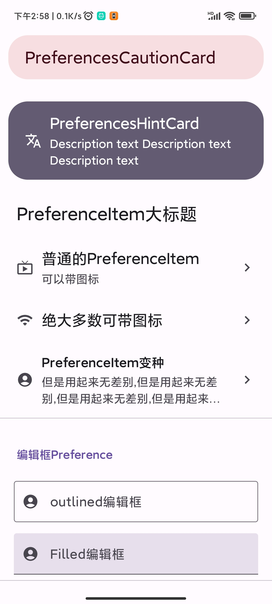
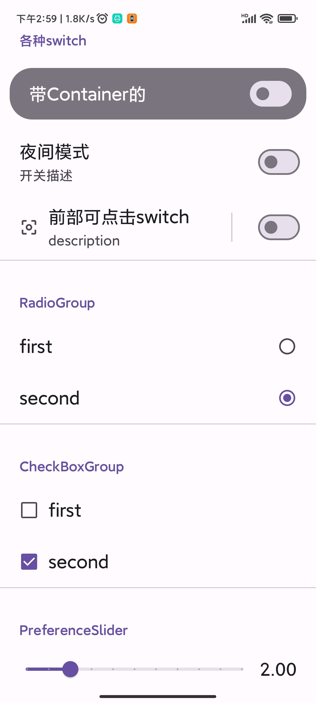
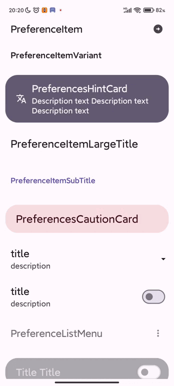
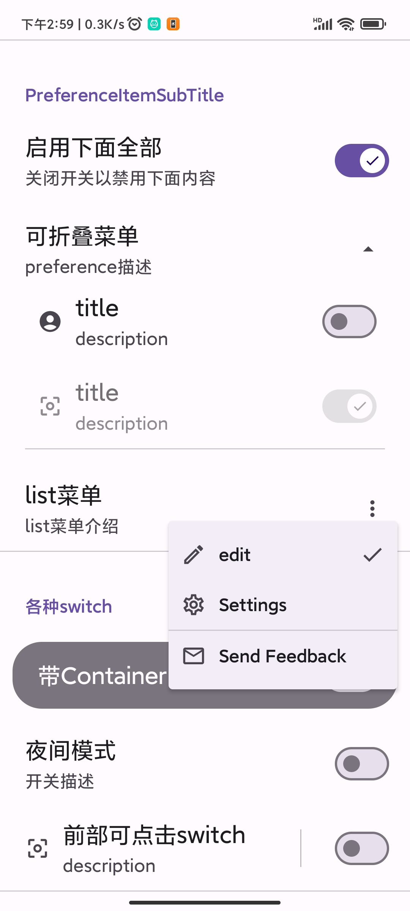
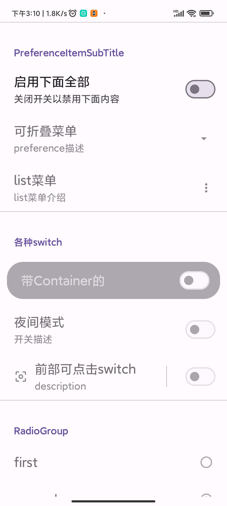
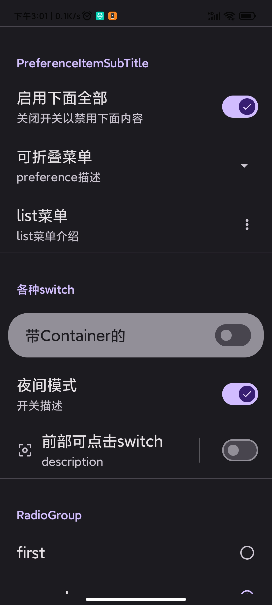

# compose material design 3 ，Preference界面组件，偏好值读取写入工具

## **版本

** [](https://jitpack.io/#Knightwood/ComposePreference)

```kotlin
dependencies {
    val version = "1.2.2"
    //必选
    implementation("com.github.Knightwood.ComposePreference:preference-data-core:$version")
    //如不需要界面，可以不引入此依赖
    implementation("com.github.Knightwood.ComposePreference:preference-ui-compose:$version")

    //偏好值读写工具，下面三选一，或者自己实现读写接口
    implementation("com.github.Knightwood.ComposePreference:preference-util:$version")
    implementation("com.github.Knightwood.ComposePreference:datastore-util:$version")
    implementation("com.github.Knightwood.ComposePreference:preference-mmkv-util:$version")
}
//注：如果使用mmkv,sharedpreference,你自己的工程不要忘记引入相应mmkv,sharedpreference依赖，以及初始化mmkv等。
```

特性：

使用简单，界面和偏好值读写分离

支持切换多种存储/读取方式

可自定义偏好值读写过程工具

提供界面组件启用状态节点依赖功能

可脱离界面，单独使用偏好值读写工具，并提供了统一写入和读取（使用flow观察值的变化）方法

## 介绍图

|                                               |                                               |                                                                                    |
|:---------------------------------------------:|:---------------------------------------------:|:----------------------------------------------------------------------------------:|
|  |  |  |
|  |  |                                       |

## 支持的存储偏好值的工具

内置三种可用的存储偏好值的工具

1. DataStore
2. MMKV
3. SharedPreference

但是注意，sharedpreference不支持存储double，mmkv不支持set<string>类型，他们所支持的有所差异。

还可以继承`PreferenceHolder`和`IPreferenceReadWrite`实现额外的存储过程，例如存储到文件、数据库等。

对于仅需要preference读写工具，而不需要ui界面的，可以仅引入`com.github.Knightwood.ComposePreference:preference-data-core`
和任意一种读写工具。

## 脱离界面，直接使用偏好值读写工具

对于datastore提供了prefStoreHolder.getReadWriteTool()方式
对于mmkv和SharedPreference,分别提供了两种工具，一种是prefStoreHolder.getReadWriteTool()方式，一种是委托的方式

### prefStoreHolder.getReadWriteTool()方式

MMKV,SharedPreference,DataStore均支持此种方式，这也是Preference组件所需要的读写工具

```
//1，获取读写工具
//MMKV
 val prefStoreHolder = MMKVPreferenceHolder.instance(MMKV.defaultMMKV())

//SharedPreference
val  prefStoreHolder =  OldPreferenceHolder.instance(
     AppCtx.instance.getSharedPreferences("ddd",Context.MODE_PRIVATE)
    )
    
//DataStore
val prefStoreHolder = DataStorePreferenceHolder.instance(
                        dataStoreName = "test",
                        ctx = AppCtx.instance
                    )
//2，获取某个偏好值
val pref =prefStoreHolder.getReadWriteTool(keyName = keyName, defaultValue = "")

//3，flow持续观察偏好值变更
pref.read().collect { s ->
	//flow收集到偏好值的变更
}

//4， 写入偏好值
pref.write("")
```

### 对于mmkv和SharedPreference的委托的方式

使用委托工具，可以像读写普通变量一样读写偏好值

#### mmkv 委托工具

```kotlin
 class MMKVHelper private constructor(val mmkv: MMKV) {
    //使用委托的方式生成一个委托对象，除了[parcelableM]方法，初始值可选
    var name by mv.strM("tom", "初始值")
}

//1. 获取单例
val helper = MMKVHelper.getInstance(prefs)
//2. 使用赋值将值存入
helper.name = "Tom"
//3. 直接使用即读取值，如果没有值写入，读取出来的会是默认值。
log.d(TAG, helper.name)

```

#### SharedPreference 委托工具

```kotlin
//注意，PrefsHelper 是单例。
class PrefsHelper private constructor(val prefs: SharedPreferences) {
    var isFinish by prefs.boolean("isFinish")
    var name by prefs.string("name")
    var age by prefs.int("age")
    //***其余无关代码省略
}

//1. 获取单例
val helper = PrefsHelper.getInstance(prefs)
//2. 使用赋值将值存入
helper.name = "Tom"
//3. 直接使用即读取值，如果没有值写入，读取出来的会是默认值。
log.d(TAG, helper.name)
```

## preference的界面组件

要构建一个preference界面，需要使用`PreferencesScope`
包裹preference的界面组件（PreferencesScope内部使用了column，因此可以放置任意的compose函数，如果现有的preference组件无法满足需要，可以放置任意compose函数构建界面），且向`PreferencesScope`
传入上面支持的三种工具之一（当然你也可以自己继承接口定制额外的存储方式，例如数据库和文件）

示例代码（仅展示部分组件和参数）：

```
//使用PreferencesScope 包裹 preference的compose函数，并且传入存储偏好值的设置工具
//PreferencesScope内部仅是使用column摆放组件，因此也可以放置自定义的compose组件


//1. 可以使用DataStore存储偏好值
// val holder = DataStorePreferenceHolder.instance(
	dataStoreName = "test",ctx =AppCtx.instance
)
    
2. 可以使用MMKV存储偏好值
// val holder = MMKVPreferenceHolder.instance(MMKV.defaultMMKV())

//3. 使用SharedPreference存储偏好值
val  holder =  OldPreferenceHolder.instance(
     AppCtx.instance.getSharedPreferences("ddd",Context.MODE_PRIVATE)
    )

@Composable
fun SettingPage() {
	PreferencesScope(holder=holder) {
    	//这里就可以使用一些compose函数构造界面，或者其他的compose函数
    	
    	 	PreferencesCautionCard(title = "PreferencesCautionCard")
            PreferencesHintCard(title = "PreferencesHintCard")

            PreferenceItemLargeTitle(title = "PreferenceItem大标题")
            PreferenceItem(
                title = "普通的PreferenceItem",
                description = "可以带图标",
                icon = Icons.Filled.LiveTv,
                endIcon = Icons.Filled.ChevronRight
            )
            PreferenceItem(
                title = "绝大多数可带图标",
                icon = Icons.Filled.Wifi,
                endIcon = Icons.Filled.ChevronRight
            )
            //文本框
            OutlinedEditTextPreference(
                title = "outlined编辑框", keyName = "edit11",
                defaultValue = "默认文本",
                icon = Icons.Filled.AccountCircle,
            )

            FilledEditTextPreference(
                defaultValue = "默认文本",
                title = "Filled编辑框",
                keyName = "edit12",
                icon = Icons.Filled.AccountCircle,
                changed = {

                }
            )
            //可折叠box
            PreferenceCollapseBox(
                title = "可折叠菜单",
                description = "preference描述",
                dependenceKey = customNodeName,
            ) {
				//这里是展开时需要显示的组件
                PreferenceSwitch(
                    keyName = "bol",
                    title = "title",
                    dependenceKey = DependenceNode.rootName,//指定依赖为根结点，这样自身就不会受到影响
                    description = "description",
                    icon = Icons.Filled.AccountCircle
                ) { state ->
                    //这里获取并修改了当前的enable状态，
                    //依赖这个节点的会改变显示状态，
                    //如果当前没有指定依赖，自身也会受到影响
                    holder.getDependence("bol")?.let {
                        it.enableStateFlow.tryEmit(state)
                    }
                }
                //依赖keyName为bol的PreferenceSwitch的state
                PreferenceSwitch(
                    keyName = "bol3",
                    title = "title",
                    dependenceKey = "bol",
                    description = "description",
                    icon = Icons.Filled.CenterFocusWeak
                )

            }
			//菜单
            PreferenceListMenu(
                title = "list菜单",
                keyName = "PreferenceListMenu",
                description = "list菜单介绍",
                dependenceKey = customNodeName,
                //这里是需要展示的菜单
                list = listOf(
                //每个MenuEntity都是一个菜单项，指明了菜单的名称，图标，存储的label等
                    MenuEntity(
                        leadingIcon = Icons.Outlined.Edit,
                        text = "edit",
                        labelKey = 0
                    ),
                    MenuEntity(
                        leadingIcon = Icons.Outlined.Settings,
                        text = "Settings",
                        labelKey = 1
                    ),
                    MenuDivider,//分割线
                    MenuEntity(
                        leadingIcon = Icons.Outlined.Email,
                        text = "Send Feedback",
                        labelKey = 2
                    ),
                )
            ) {
                Log.d(TAG, "menu item labelKey: $it")
            }
      
      PreferenceRadioGroup(
        keyName = "radioGroup",
        labels = listOf(
            "first",
            "second"
        ),
        left = false,//这样可以把radio放到右边，text放在左边，CheckBox同理
        changed = {
            Log.d(TAG, "radio: ${it}")
        }
    )
    
    PreferenceCheckBoxGroup(
        keyName = "CheckBoxGroup",
        labelPairs = listOf(
              "first" to 3,
              "second" to 1
         ), changed = {
            
        }
    )
    	//其他组件
	}
}
```

可用的组件（如上方代码，在PreferencesScope中）：

**大卡片**

* PreferencesCautionCard
* PreferencesHintCard

**preference item / 标题**

* PreferenceItemLargeTitle
* PreferenceItemSubTitle
* PreferenceItem
* PreferenceItemVariant

**文本输入框**

* FilledEditTextPreference
* OutlinedEditTextPreference

**switch**

* PreferenceSwitch
* PreferenceSwitchWithContainer
* PreferenceSwitchWithDivider

**可折叠其他组件的box**

* PreferenceCollapseBox

**点击菜单**

* PreferenceListMenu

**Radio**

* PreferenceRadioGroup

**CheckBox**

* PreferenceCheckBoxGroup

**Slider**

* PreferenceSlider

## 依赖和置灰

* enable使用: preference组件传入enable为false的同时，指定dependenceKey为DependenceNode.rootName，可以置灰组件，使之无法相应事件。

* 依赖的使用：例如：有三个开关：a,b,c

当开关a切换为off时，将b和c置灰。

原理：我们使用一个mutablestate保存enable状态，b和c都观察这个状态，当开关a为off时修改这个状态，b和c就会因为观察这个状态而重组，从而达到目的。

每一个preference可组合函数，都会根据自身的keyName生成一个这样的状态，并将状态保存在上面的holder中，所以要达到开关a为off时禁用b和c，有两种方式：

1. 自己注册一个状态节点（例如为node1），然后将b，c的dependenceKey指定为node1的name，然后修改这个node1状态
2. 将b，c的dependenceKey指定为a的keyName，然后获取a的节点状态并进行修改，但是要注意，开关a需要指定dependenceKey为其他，否则a也会受到影响

第一种方式例子：

```kotlin
PreferencesScope(holder = holder) {

    val node = holder.registerDependence("customNode", true)// 1

//PreferenceItem可组合函数
    PreferenceSwitchWithDivider(
        keyName = "bol3",
        title = "title",
        dependenceKey = "customNode", // 2
        description = "description",
        icon = Icons.Filled.CenterFocusWeak
    )
    PreferenceSwitch(
        keyName = "bol2",
        title = "title",
        description = "description",
        icon = Icons.Filled.CenterFocusWeak
    ) {
        node.enableState.value = it //3 修改节点状态
    }
}

```

1. 代码1处创建一个了一个自定义状态节点，enable状态为true，并将节点命名为"customNode"
2. 代码2处表示这个PreferenceItem可组合函数的enable状态依赖于1处创建的名为"customNode"的节点状态
3. 代码3处根据switch修改了"customNode"的enable状态，此时，依赖此node的可组合函数都会收到影响

第二种方式例子

```kotlin
PreferencesScope(holder = holder) {
    //switch A
    PreferenceSwitch(
        keyName = "bol",
        title = "title",
        dependenceKey = DependenceNode.rootName,//指定依赖为根结点，这样自身就不会受到影响
        description = "description"
    ) { state ->
        //这里获取并修改了当前的enable状态，
        //依赖这个节点的会改变显示状态，
        //如果当前没有指定依赖，自身也会受到影响
        holder.getDependence("bol")?.let {
            it.enableState.value = state
        }
    }
    //switch B
    PreferenceSwitch(
        keyName = "bol2",
        title = "title",
        dependenceKey = "bol", //依赖key为bol的状态
        description = "description",
        icon = Icons.Filled.CenterFocusWeak
    )
}
```

这个例子中没有new一个node，却能达到效果。

这是因为preference可组合函数会根据自身的keyName和enable参数（ switch A 传入的keyName为"bol"
，enable默认为true），生成一个node保存起来。 可以通过调用holder.getDependence(key name)得到状态节点。

switch B 依赖于switch A 注册的enable状态，当A通过getDependence方法获取到节点状态并做出修改时，
switch B 就会重组从而置灰。

但我们发现，switch A却没有因为修改状态被置灰，这是因为 switch A 把自己的dependence指定为了一个默认的内置状态节点，所以switch
A会受到DependenceNode.rootName节点影响
却不会受到自身节点状态的影响。
若希望switch A收到自身节点状态的影响，只需要switch A不指定dependenceKey，保持它为null即可。
